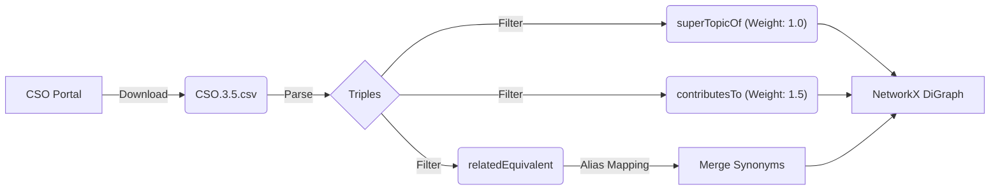
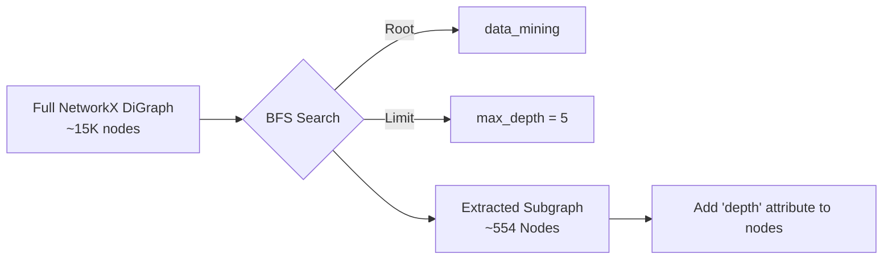
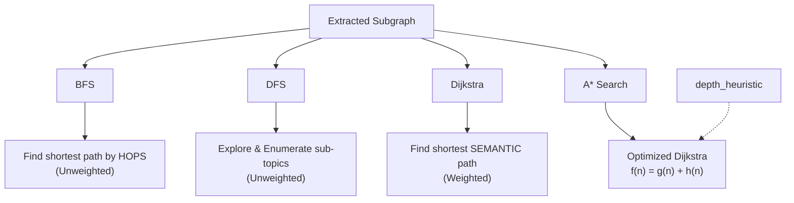
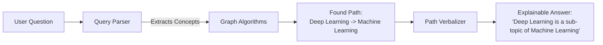

# Bài 4: System Architecture & Knowledge Map

Sơ đồ Mermaid khi gộp lại quá lớn sẽ bị thu nhỏ chữ khiến bạn khó đọc. Vì vậy, tôi đã chia nhỏ bức tranh tổng thể thành một **Bản trình chiếu (Carousel)** gồm 4 phần riêng biệt. 

Hãy bấm mũi tên qua lại để xem từng module của hệ thống nhé:

````carousel
### 1. Data Acquisition & Construction
Sơ đồ mô tả cách lấy dữ liệu từ CSO, lọc các quan hệ cần thiết và xây dựng đồ thị NetworkX ban đầu.


<!-- slide -->
### 2. Graph Pruning (Cắt tỉa đồ thị)
Sơ đồ mô tả cách dùng BFS để trích xuất một nhánh nhỏ (subgraph) đủ sức tính toán từ đồ thị khổng lồ ban đầu.


<!-- slide -->
### 3. Algorithm Layer (Thuật toán duyệt đồ thị)
Sơ đồ mô tả 4 thuật toán cốt lõi và mục đích của chúng khi áp dụng vào Question Answering.


<!-- slide -->
### 4. Explainable QA (Đích đến cuối cùng)
Sơ đồ mô tả cách hệ thống lấy kết quả từ thuật toán để tạo ra câu trả lời giải thích được.


````

### Tóm tắt các phân hệ (Layers):
1. **Data Acquisition:** Lấy dữ liệu từ CSO và cấu trúc Triples.
2. **Graph Construction:** Lọc nhiễu, gộp node đồng nghĩa (Alias Mapping), và tiêm trọng số (Semantic Weights).
3. **Graph Pruning:** Cắt tỉa đồ thị bằng BFS để lấy ra một mảnh nhỏ (subgraph) đủ sức tính toán.
4. **Algorithm Layer:** 4 thuật toán đồ thị và cách chọn thuật toán cho từng loại câu hỏi.
5. **Explainable QA:** Biến đường đi (path) thành câu trả lời tự nhiên.
