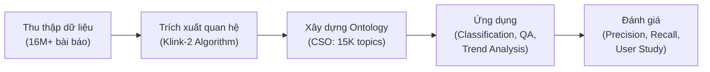
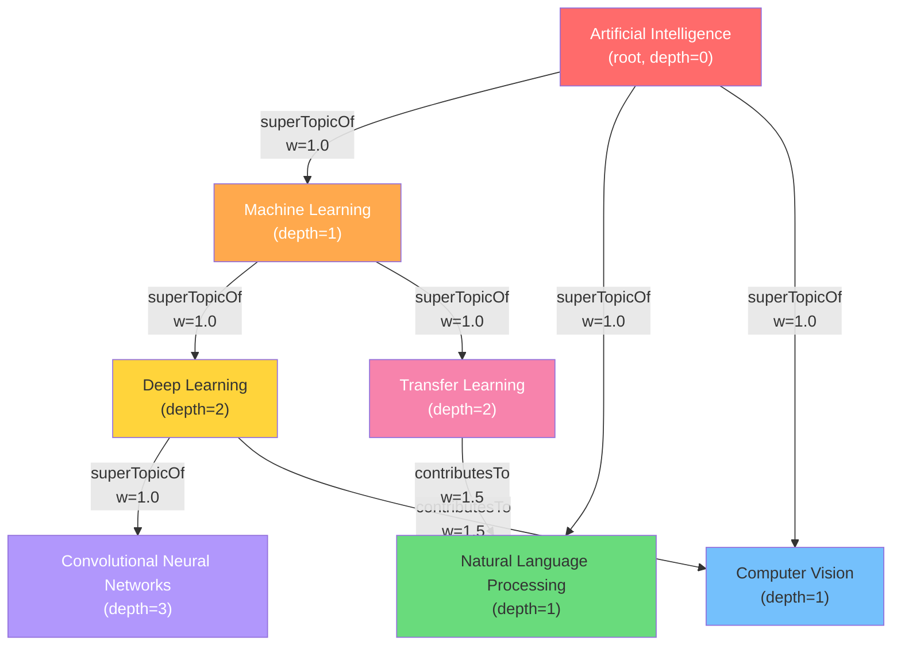

# Kế Hoạch Triển Khai: Hệ Thống Hỏi-Đáp Khái Niệm Học Thuật với CSO & Thuật Toán Đồ Thị

## Tổng quan

Sử dụng **Computer Science Ontology (CSO)** — bộ bản thể học ~15,000 khái niệm và ~166,000 quan hệ ngữ nghĩa trong lĩnh vực Khoa học máy tính — làm Knowledge Graph nền tảng. Thu nhỏ CSO thành một đồ thị con phù hợp, sau đó áp dụng các thuật toán đồ thị cổ điển (BFS, DFS, Dijkstra, A*) để xây dựng hệ thống hỏi-đáp khái niệm minh bạch (Explainable QA).

**Ngôn ngữ:** Python 3.10+
**Cơ sở dữ liệu đề xuất:** NetworkX (xem phân tích bên dưới)

---

## 1. Tóm Tắt Insights Từ Nghiên Cứu

### 1.1 Bài báo "Scholarly Knowledge Graphs through Structuring Scholarly Communication: A Review"

Bài báo này tổng hợp cách các nhà nghiên cứu chuyển đổi giao tiếp học thuật (scholarly communication) từ dạng phi cấu trúc sang dạng máy có thể xử lý được (machine-actionable). Các insight chính:

| Insight | Ý nghĩa cho dự án của bạn |
|:---|:---|
| **Từ tài liệu → đồ thị**: Xu hướng hiện đại là coi các bài báo/khái niệm như các node liên kết trong đồ thị lớn, thay vì tài liệu độc lập | CSO chính là hiện thực hóa của xu hướng này — mỗi khái niệm CS là 1 node, mối quan hệ ngữ nghĩa là edge |
| **Tự động hóa là tất yếu**: CSO được sinh tự động bằng thuật toán **Klink-2** từ 16 triệu+ bài báo. Curation thủ công không thể theo kịp tốc độ xuất bản | Bạn không cần tự tạo ontology → tận dụng CSO có sẵn, chỉ cần **thu nhỏ** (prune) phù hợp |
| **Phân loại ngữ nghĩa** (Semantic Classification): CSO Classifier tự động gán nhãn topic cho bài báo, vượt xa keyword matching đơn giản | Hệ thống QA của bạn cũng nên hoạt động ở mức ngữ nghĩa (semantic), không chỉ so khớp chuỗi |
| **Explainability**: Đường đi (path) trong đồ thị tri thức tự nó là lời giải thích cho câu trả lời | Đây chính là core value của dự án: path = explanation |
| **Cấu trúc phân cấp + liên kết ngang**: CSO kết hợp cả hierarchy (superTopicOf) và cross-links (contributesTo) | Cho phép cả duyệt theo chiều sâu lẫn tìm mối liên kết giữa các nhánh khác nhau |

### 1.2 Cách tiếp cận của các nhà nghiên cứu



**Bạn sẽ bắt đầu từ bước C** — tận dụng CSO đã xây dựng sẵn, thu nhỏ nó, rồi triển khai ứng dụng QA và đánh giá.

---

## 2. Thu Thập & Tải Dữ Liệu CSO

### 2.1 Nguồn tải

| Nguồn | URL | Định dạng |
|:---|:---|:---|
| **CSO Portal** (chính thức) | https://cso.kmi.open.ac.uk/downloads | `.csv`, `.owl`, `.nt`, `.ttl` |
| **CSO Classifier** (Python lib) | `pip install cso-classifier` | Tự tải & cache CSO |

> [!IMPORTANT]
> **Đề xuất:** Tải file **CSV** từ CSO Portal. Đây là định dạng đơn giản nhất để parse bằng Python (pandas), không cần thư viện RDF phức tạp.

### 2.2 Cấu trúc file CSV gốc

File CSV của CSO theo dạng **triple** (Subject-Predicate-Object):

| Subject | Predicate | Object |
|:---|:---|:---|
| `machine learning` | `superTopicOf` | `deep learning` |
| `ontology matching` | `relatedEquivalent` | `ontology mapping` |
| `ontology engineering` | `contributesTo` | `semantic web` |
| `artificial intelligence` | `superTopicOf` | `machine learning` |

### 2.3 Chiến lược thu nhỏ (Pruning Strategy)

Toàn bộ CSO có ~15,000 nodes — quá lớn cho mục đích demo và đánh giá thuật toán. Chiến lược:

1. **Chọn một nhánh gốc (Root Branch)**: Ví dụ `artificial intelligence` hoặc `data science`
2. **Trích xuất subgraph bằng BFS/DFS**: Từ root, duyệt theo `superTopicOf` với giới hạn độ sâu (depth ≤ 4-5)
3. **Mở rộng bằng `contributesTo`**: Thêm các node liên kết ngang từ nhánh khác (giới hạn 1 hop)
4. **Gộp `relatedEquivalent`**: Hợp nhất các node đồng nghĩa thành 1 node duy nhất (giữ lại tên ưu tiên)

**Kích thước mục tiêu sau pruning:** ~500-2,000 nodes, ~2,000-8,000 edges

> [!TIP]
> Bạn có thể tạo nhiều subgraph với các root khác nhau để đánh giá thuật toán trên các topology khác nhau (cây sâu vs. cây rộng).

---

## 3. Đề Xuất Cơ Sở Dữ Liệu

### 3.1 Phân tích lựa chọn

| Tiêu chí | **NetworkX** (Python lib) | **Neo4j** (Graph DB) | **SQLite + Custom** |
|:---|:---|:---|:---|
| Độ phức tạp setup | ✅ Rất thấp (`pip install`) | ⚠️ Cần cài server riêng | ⚠️ Phải tự viết graph logic |
| Thuật toán đồ thị tích hợp | ✅ BFS, DFS, Dijkstra, A* có sẵn | ⚠️ Có nhưng qua Cypher/GDS plugin | ❌ Phải tự cài đặt |
| Khả năng tuỳ biến thuật toán | ✅ Toàn quyền (Python native) | ❌ Bị giới hạn bởi Cypher | ✅ Toàn quyền |
| Phù hợp quy mô ~2K nodes | ✅ Hoàn hảo | ⚠️ Overkill | ⚠️ Thiếu tính năng |
| Trực quan hóa | ✅ `matplotlib`, export Gephi | ✅ Neo4j Browser | ❌ Không có |
| Phù hợp bài nghiên cứu học thuật | ✅ Chuẩn mực trong nghiên cứu | ⚠️ Thiên về production | ❌ Không chuyên biệt |

### 3.2 Quyết định

> [!IMPORTANT]
> **Đề xuất sử dụng NetworkX** làm cơ sở dữ liệu chính.
>
> **Lý do:**
> - Với quy mô ~2K nodes sau pruning, NetworkX xử lý thoải mái trong bộ nhớ
> - Mục tiêu dự án là **nghiên cứu thuật toán đồ thị**, không phải xây dựng hệ thống production → cần khả năng tùy biến thuật toán, không cần persistence phức tạp
> - NetworkX là thư viện chuẩn mực trong nghiên cứu học thuật về đồ thị
> - Có sẵn BFS, DFS, Dijkstra → dùng để **benchmark** so với implementation tự viết
> - Export sang JSON/CSV để lưu trữ persistent khi cần

**Lưu trữ persistent:** Dùng JSON files trong thư mục `data/` (export từ NetworkX) — đơn giản, portable, version-control được.

---

## 4. Thiết Kế Cấu Trúc Dữ Liệu (Graph Data Model)

### 4.1 Node (Khái niệm)

```python
# Mỗi node trong NetworkX Graph sẽ có các thuộc tính:
{
    "id": "deep_learning",              # ID duy nhất (lowercase, underscore)
    "label": "Deep Learning",           # Tên hiển thị
    "aliases": ["deep neural networks"], # Danh sách tên đồng nghĩa (từ relatedEquivalent)
    "depth": 3,                         # Độ sâu trong cây phân cấp (từ root)
    "branch": "artificial_intelligence", # Nhánh gốc
    "degree": 12                        # Số cạnh kết nối (tính sau khi build graph)
}
```

### 4.2 Edge (Quan hệ)

```python
# Mỗi edge sẽ có các thuộc tính:
{
    "type": "superTopicOf",   # Loại quan hệ: superTopicOf | contributesTo
    "weight": 1.0,            # Trọng số cho Dijkstra/A*
    "label": "is parent of"   # Nhãn ngôn ngữ tự nhiên (cho QA verbalization)
}
```

### 4.3 Bảng trọng số đề xuất

Trọng số thể hiện "khoảng cách ngữ nghĩa" — giá trị càng nhỏ = quan hệ càng chặt chẽ:

| Loại quan hệ | Weight | Lý do |
|:---|:---|:---|
| `superTopicOf` / `subTopicOf` | **1.0** | Quan hệ phân cấp trực tiếp, rất gần gũi |
| `contributesTo` | **1.5** | Quan hệ đóng góp — liên quan nhưng không trực tiếp bằng cha-con |
| `relatedEquivalent` | **0.1** | Gần như đồng nghĩa (sẽ merge thành 1 node, weight này dùng nếu giữ riêng) |

> [!NOTE]
> Bạn có thể thử nghiệm nhiều bộ trọng số khác nhau và so sánh kết quả — đây là một contribution tốt cho phần Evaluation.

### 4.4 Mô hình đồ thị tổng thể



---

## 5. Các Thuật Toán Cần Triển Khai

### 5.1 Tổng quan thuật toán

| # | Thuật toán | Mục đích trong QA | Input | Output |
|:---|:---|:---|:---|:---|
| 1 | **BFS** | Tìm đường đi ngắn nhất (unweighted) giữa 2 khái niệm | Node nguồn, Node đích | Đường đi + số hop |
| 2 | **DFS** | Khám phá toàn bộ nhánh con của 1 khái niệm | Node gốc, Depth limit | Danh sách khái niệm liên quan |
| 3 | **Dijkstra** | Tìm đường đi có tổng trọng số nhỏ nhất (weighted) | Node nguồn, Node đích | Đường đi + tổng weight |
| 4 | **A\*** | Dijkstra + heuristic → tìm nhanh hơn | Node nguồn, Node đích, $h(n)$ | Đường đi + tổng weight |

### 5.2 Chi tiết từng thuật toán

#### 5.2.1 BFS (Breadth-First Search)
- **Câu hỏi QA phù hợp:** *"Deep Learning liên quan gần nhất đến Computer Vision qua bao nhiêu bước?"*
- **Cách hoạt động trên CSO:** Duyệt theo từng lớp (level-by-level) từ node nguồn, bỏ qua trọng số cạnh
- **Ưu điểm:** Luôn tìm được đường đi ít hop nhất
- **Nhược điểm:** Không xem xét loại quan hệ (coi `superTopicOf` và `contributesTo` như nhau)

#### 5.2.2 DFS (Depth-First Search)
- **Câu hỏi QA phù hợp:** *"Liệt kê tất cả khái niệm thuộc nhánh Machine Learning"*
- **Cách hoạt động trên CSO:** Đi sâu vào từng nhánh `superTopicOf` trước khi quay lui
- **Ưu điểm:** Tốt cho việc khám phá và liệt kê cây phân cấp
- **Nhược điểm:** Không đảm bảo đường đi ngắn nhất, có thể bị kẹt ở nhánh sâu

#### 5.2.3 Dijkstra
- **Câu hỏi QA phù hợp:** *"Mối liên hệ chặt chẽ nhất giữa Database và Machine Learning là gì?"*
- **Cách hoạt động trên CSO:** Sử dụng trọng số cạnh (weight) để tìm đường đi có tổng chi phí nhỏ nhất
- **Ưu điểm:** Cân nhắc loại quan hệ qua trọng số → kết quả có ý nghĩa ngữ nghĩa hơn BFS
- **Nhược điểm:** Chậm hơn A* vì không có heuristic định hướng

#### 5.2.4 A* Search
- **Câu hỏi QA phù hợp:** Giống Dijkstra nhưng trên đồ thị lớn hơn
- **Thiết kế hàm Heuristic $h(n)$:**

```python
def heuristic(current_node, goal_node, graph):
    """
    Heuristic dựa trên khoảng cách trong cây phân cấp CSO.

    Ý tưởng: Hai khái niệm cùng nằm trên một nhánh (cùng tổ tiên gần)
    thì khoảng cách heuristic nhỏ. Hai khái niệm ở hai nhánh xa nhau
    thì heuristic lớn.

    Công thức: h(n) = |depth(n) - depth(goal)| * base_weight

    Giải thích:
    - Nếu current và goal ở cùng depth → h ≈ 0 (khả năng gần nhau)
    - Nếu current ở depth 1, goal ở depth 5 → h lớn (phải đi xa)
    """
    depth_current = graph.nodes[current_node].get('depth', 0)
    depth_goal = graph.nodes[goal_node].get('depth', 0)
    return abs(depth_current - depth_goal) * 1.0
```

> [!TIP]
> **Điểm nhấn học thuật:** Bạn có thể thiết kế và so sánh **nhiều hàm heuristic khác nhau** (depth-based, branch-based, LCA-based) và đánh giá tác động lên hiệu suất A*. Đây là contribution có giá trị cho bài nghiên cứu.

### 5.3 Ma trận so sánh (dùng cho phần Evaluation)

| Tiêu chí | BFS | DFS | Dijkstra | A* |
|:---|:---|:---|:---|:---|
| Tìm shortest path (unweighted) | ✅ Tối ưu | ❌ Không | ✅ Tối ưu | ✅ Tối ưu |
| Tìm shortest path (weighted) | ❌ Không | ❌ Không | ✅ Tối ưu | ✅ Tối ưu |
| Thời gian chạy | $O(V+E)$ | $O(V+E)$ | $O((V+E)\log V)$ | ≤ Dijkstra (với heuristic tốt) |
| Ý nghĩa ngữ nghĩa của path | Thấp | Thấp | Cao | Cao |
| Phù hợp cho QA | Câu hỏi đơn giản | Liệt kê/khám phá | Câu hỏi liên quan | Câu hỏi liên quan (đồ thị lớn) |

---

## 6. Các Bước Triển Khai Code

### Phase 1: Thiết lập dự án & Tải dữ liệu

#### [MODIFY] [requirements.txt](file:///d:/semester4/CSD201/knowledge_graph_research/kgqa_graph_algorithms/requirements.txt)
Tạo file dependencies:
```
networkx>=3.1
pandas>=2.0
matplotlib>=3.7
```

#### [NEW] `data/raw/cso_triples.csv`
Tải file CSV gốc từ CSO Portal và đặt vào đây.

#### [NEW] [data_loader.py](file:///d:/semester4/CSD201/knowledge_graph_research/kgqa_graph_algorithms/src/data_loader.py)
Module parse file CSV thành danh sách triples `(subject, predicate, object)`. Lọc bỏ các predicate không cần thiết (giữ lại `superTopicOf`, `contributesTo`, `relatedEquivalent`).

---

### Phase 2: Xây dựng đồ thị & Thu nhỏ

#### [NEW] [graph_builder.py](file:///d:/semester4/CSD201/knowledge_graph_research/kgqa_graph_algorithms/src/graph_builder.py)
- Load triples từ `data_loader`
- Tạo `nx.DiGraph()` (đồ thị có hướng)
- Gán thuộc tính cho nodes (label, depth, branch) và edges (type, weight, label)
- Merge các node `relatedEquivalent` thành 1 node

#### [NEW] [graph_pruner.py](file:///d:/semester4/CSD201/knowledge_graph_research/kgqa_graph_algorithms/src/graph_pruner.py)
- Hàm `extract_subgraph(root, max_depth)`: BFS từ root theo `superTopicOf`, giới hạn depth
- Hàm `expand_cross_links(subgraph, full_graph, max_hops=1)`: Thêm `contributesTo` edges
- Hàm `compute_node_depths(subgraph, root)`: Tính depth cho từng node
- Export subgraph ra `data/processed/subgraph_ai.json`

---

### Phase 3: Cài đặt thuật toán đồ thị

#### [NEW] [algorithms/bfs.py](file:///d:/semester4/CSD201/knowledge_graph_research/kgqa_graph_algorithms/src/algorithms/bfs.py)
BFS tìm shortest path (unweighted) giữa 2 nodes. Trả về path + visited count.

#### [NEW] [algorithms/dfs.py](file:///d:/semester4/CSD201/knowledge_graph_research/kgqa_graph_algorithms/src/algorithms/dfs.py)
DFS với depth limit. Hai mode: (1) tìm path giữa 2 nodes, (2) liệt kê subtree.

#### [NEW] [algorithms/dijkstra.py](file:///d:/semester4/CSD201/knowledge_graph_research/kgqa_graph_algorithms/src/algorithms/dijkstra.py)
Dijkstra tìm shortest weighted path. Trả về path + total weight + visited count.

#### [NEW] [algorithms/astar.py](file:///d:/semester4/CSD201/knowledge_graph_research/kgqa_graph_algorithms/src/algorithms/astar.py)
A* Search với heuristic function có thể thay đổi (pluggable). Trả về path + total weight + visited count.

#### [NEW] [algorithms/heuristics.py](file:///d:/semester4/CSD201/knowledge_graph_research/kgqa_graph_algorithms/src/algorithms/heuristics.py)
Các hàm heuristic cho A*:
- `depth_heuristic(n, goal)`: Dựa trên chênh lệch depth
- `branch_heuristic(n, goal)`: Dựa trên cùng/khác nhánh
- `lca_heuristic(n, goal)`: Dựa trên Lowest Common Ancestor

> [!IMPORTANT]
> Tất cả thuật toán phải được **tự cài đặt từ đầu** (không dùng `nx.shortest_path`). Các hàm NetworkX built-in chỉ được dùng để **verify kết quả** (benchmark).

---

### Phase 4: Module Hỏi-Đáp (QA)

#### [NEW] [qa/query_parser.py](file:///d:/semester4/CSD201/knowledge_graph_research/kgqa_graph_algorithms/src/qa/query_parser.py)
- Parse câu hỏi người dùng thành cặp `(source_concept, target_concept)`
- Fuzzy matching tên khái niệm với node labels trong graph (dùng `difflib` hoặc simple string matching)
- Xác định loại câu hỏi: "relationship" (Dijkstra/A*), "subtopics" (DFS), "distance" (BFS)

#### [NEW] [qa/path_verbalizer.py](file:///d:/semester4/CSD201/knowledge_graph_research/kgqa_graph_algorithms/src/qa/path_verbalizer.py)
- Chuyển đổi path kết quả thành câu trả lời tiếng Anh
- Ví dụ input: `[("deep learning", "subTopicOf", "machine learning"), ("machine learning", "subTopicOf", "artificial intelligence")]`
- Ví dụ output: *"Deep Learning is a sub-topic of Machine Learning, which is a sub-topic of Artificial Intelligence."*

#### [NEW] [qa/qa_engine.py](file:///d:/semester4/CSD201/knowledge_graph_research/kgqa_graph_algorithms/src/qa/qa_engine.py)
- Orchestrator: nhận câu hỏi → parse → chọn thuật toán → chạy → verbalize → trả kết quả
- Trả về cả câu trả lời lẫn metadata (thuật toán dùng, thời gian chạy, số node visited)

---

### Phase 5: Đánh giá (Evaluation)

#### [NEW] [evaluation/benchmark.py](file:///d:/semester4/CSD201/knowledge_graph_research/kgqa_graph_algorithms/src/evaluation/benchmark.py)
- Tạo bộ test gồm ~50-100 cặp câu hỏi (source, target)
- Chạy cả 4 thuật toán trên mỗi cặp
- Thu thập metrics: execution time, path length, total weight, nodes visited
- Export kết quả ra CSV

#### [NEW] [evaluation/visualizer.py](file:///d:/semester4/CSD201/knowledge_graph_research/kgqa_graph_algorithms/src/evaluation/visualizer.py)
- Vẽ biểu đồ so sánh hiệu suất 4 thuật toán (bar chart, line chart)
- Highlight path tìm được trên đồ thị (graph visualization)

---

### Phase 6: Demo & Tích hợp

#### [NEW] [main.py](file:///d:/semester4/CSD201/knowledge_graph_research/kgqa_graph_algorithms/main.py)
- CLI interface cho hệ thống QA
- Người dùng nhập câu hỏi → hệ thống trả lời + hiển thị path
- Hiển thị so sánh kết quả giữa các thuật toán

---

## 7. Cấu Trúc Thư Mục Cuối Cùng

```
kgqa_graph_algorithms/
├── README.md
├── requirements.txt
├── main.py                          # Entry point - CLI QA demo
├── data/
│   ├── raw/
│   │   └── cso_triples.csv          # File CSO gốc tải về
│   └── processed/
│       ├── subgraph_ai.json         # Subgraph đã pruned (nodes + edges)
│       └── subgraph_stats.json      # Thống kê: số nodes, edges, depth
├── src/
│   ├── __init__.py
│   ├── data_loader.py               # Parse CSV → triples
│   ├── graph_builder.py             # Triples → NetworkX DiGraph
│   ├── graph_pruner.py              # Full graph → Subgraph
│   ├── algorithms/
│   │   ├── __init__.py
│   │   ├── bfs.py
│   │   ├── dfs.py
│   │   ├── dijkstra.py
│   │   ├── astar.py
│   │   └── heuristics.py
│   ├── qa/
│   │   ├── __init__.py
│   │   ├── query_parser.py
│   │   ├── path_verbalizer.py
│   │   └── qa_engine.py
│   └── evaluation/
│       ├── __init__.py
│       ├── benchmark.py
│       └── visualizer.py
├── notebooks/
│   ├── 01_explore_cso.ipynb         # Khám phá dữ liệu CSO
│   ├── 02_subgraph_analysis.ipynb   # Phân tích subgraph
│   └── 03_algorithm_comparison.ipynb # So sánh thuật toán
└── docs/
    └── ...
```

---

## 8. Verification Plan

### Automated Tests
```bash
# Chạy unit tests cho các thuật toán
python -m pytest tests/ -v

# So sánh output thuật toán tự viết với NetworkX built-in
python -m src.evaluation.benchmark --verify
```

### Manual Verification
- Chạy QA demo với các câu hỏi mẫu và kiểm tra tính hợp lý của câu trả lời
- Xem graph visualization để xác nhận path tìm được đúng trực quan
- So sánh path của Dijkstra vs BFS để xác nhận weight có tác dụng thực sự

---

## Open Questions

> [!IMPORTANT]
> **Chọn nhánh gốc để pruning:** Bạn muốn chọn nhánh nào làm subgraph chính?
> - `artificial intelligence` (rộng, nhiều sub-topics)
> - `data science` (cân bằng)
> - `software engineering` (khác biệt, ít overlap với AI)
> - Hoặc một nhánh khác?

> [!IMPORTANT]
> **Ngôn ngữ giao diện QA:** Câu trả lời verbalized nên bằng tiếng Anh hay tiếng Việt?

> [!IMPORTANT]
> **Mức độ phức tạp của Query Parser:** Bạn muốn dùng:
> - **Simple:** Người dùng nhập trực tiếp 2 tên khái niệm (dễ, phù hợp MVP)
> - **Advanced:** Người dùng nhập câu hỏi tự nhiên, hệ thống tự extract khái niệm (phức tạp hơn nhưng impressive hơn)
